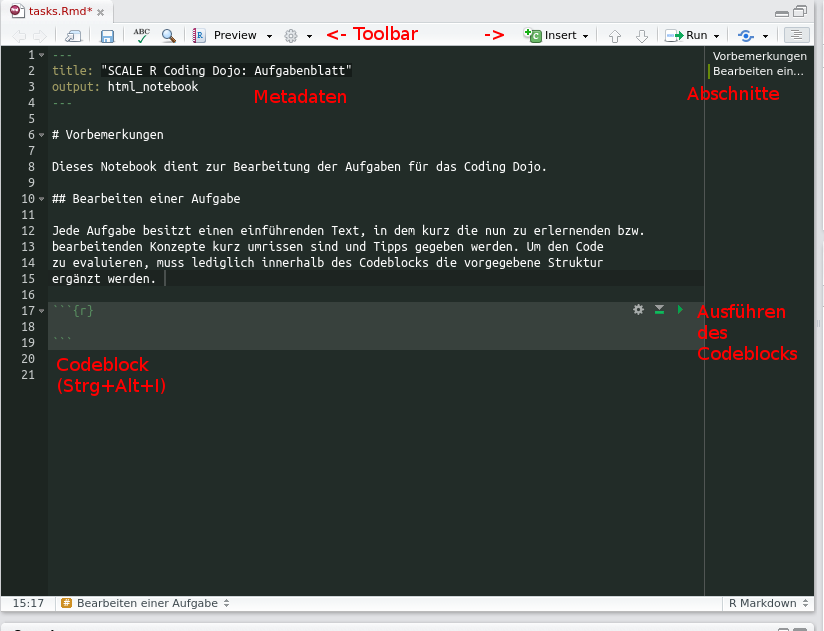

# Vorbemerkungen

Dieses Notebook dient zur Bearbeitung der Aufgaben für das Coding Dojo. Wir arbeiten
mit RMarkdown, welches eine Erweiterung des Standard Markdowns ist. Neu hinzu kommen
Code Blöcke, die man evaluieren kann. Die Vorteile von RMarkdown sind:

* Kombination von Prosa zur Dokumentation und Beschreibung und Code
* Exportierbar als HTML, PDF (Latex oder Beamer)

## Bearbeiten einer Aufgabe

Jede Aufgabe besitzt einen einführenden Text, in dem kurz die nun zu erlernenden bzw. 
bearbeitenden Konzepte kurz umrissen sind und Tipps gegeben werden. Um den Code
zu evaluieren, muss lediglich innerhalb des Codeblocks die vorgegebene Struktur
ergänzt werden. 

Im Folgenden ist eine Übersicht, was sich wo im Markdown Editor von RStudio befindet, um
den Einstieg etwas zu erleichtern.




## Aufgabe: Installation von RStudio

Diese Aufgabe muss nur bewältigt werden, wenn kein RStudio und R auf dem Rechner vorhanden ist. Zusätzlich
zu RStudio benötigen wir folgende Systembibliotheken in einem *Linux* System (exemplarisch für Debian-Systeme):

* `libxml2-dev`
* `gfortran`
* `r-base`

Entweder lädt man nun [RStudio](https://www.rstudio.com/products/rstudio/download/) von der offiziellen Website herunter oder führt folgendes in seiner Konsole aus:

```{sh, eval = FALSE, echo = TRUE}
sudo sh -c 'echo "deb http://cran.rstudio.com/bin/linux/ubuntu trusty/" >> /etc/apt/sources.list'
gpg --keyserver keyserver.ubuntu.com --recv-key E084DAB9
gpg -a --export E084DAB9 | sudo apt-key add -
sudo apt-get update
sudo apt-get -y install r-base libapparmor1 libcurl4-gnutls-dev libxml2-dev libssl-dev gdebi-core
sudo apt-get install libcairo2-dev
sudo apt-get install libxt-dev
sudo apt-get install git-core
wget https://download2.rstudio.org/rstudio-server-0.99.903-amd64.deb
sudo gdebi rstudio-server-0.99.903-amd64.deb
```

Nun benötigen wir noch einige Pakete, die vorher aus Zeitgründen installiert werden sollten.
Hierfür kann folgender Code ausgeführt werden:

```{r, eval=FALSE, echo=TRUE}
install.packages(c('devtools', 'ggplot2', 'dplyr', 'testthat'), repos = 'http://cran.rstudio.com/')
```

## RStudio erkunden

### Erstellen eines Projektes

**Aufgabe**
* Erstelle ein neues R Projekt (*Empty Project*) in einem neuen Verzeichnis (*New Directory*).
* Klone das Coding Dojo Projekt (*Version Control*) und öffne die Datei *tasks.Rmd*.

**Aufgabe** Zum Schluss füge in dieses Dokument deinen ersten R Code ein! Die Funktion ist `print('Hello, World')`.
Anschließend müssen die Änderungen über das Git Menü comitted werden. Danach kann man sich den Diff
ebenfalls im Git Reiter anschauen.

```{r hello_world}
# Hier den Code einfügen
```

Um Informationen zu einem Package oder einer Funktion zu erhalten, kann man entweder den "Help"
Reiter benutzen oder die `help` Funktion benutzen. 

**Aufgabe** Finde Informationen zur Funktion `sapply`!

```{r use_help}

```

## R Basics I

Die Basistypen von R sind folgende: 

* Numerische Werte (Integer und Floats) `1, 2, 2.5, -5.6`
* Boolsche Werte mit `TRUE, T` für true und `FALSE, F` für false
* Strings `'string', "string"`
* `NULL`
* Vektoren `1:10, c(1,2,3)`
* Listen `list(a = "x", b = 3)` als Key-Value Paare

Als Kontrollstrukturen stellt R folgende Konstrukte bereit:

* `for` und `while` Schleifen (wie in C, Java, ...)
* `if/else` (wie in C, Java, ...)
* Zuweisung `x <- 3` oder `x = 3` (unüblich)

Operationen wie z.B die Addition sind im Normalfall vektorisiert, d.h. das Addieren eines Skalars zu einem Vektor
addiert das Skalar zu jedem Wert des Vektors.

**Aufgabe** Benutze die REPL, um die Syntax einzuüben (z.B Variablenzuweisung, if/else, Artihmetik etc)

### Aufgabenblock 1

**Aufgabe** Addiere `5` zu `x` und `y` und evaluiere den Code.

```{r basics_add}
x <- c(1,2,3)
y <- 3
```

**Aufgabe** Gebe die Zahlen von 1 bis 10 auf der Konsole aus

```{r basics_print_range}
print(1:10)
```

**Aufgabe** Prüfe, ob `maybe_true` wirklich `TRUE` ist und gebe in dem Fall `"it is true"` aus, sonst `"it is false"`

```{r basics_maybe_true}
maybe_true <- (TRUE || FALSE) && (!FALSE && FALSE || TRUE)
ifelse(maybe_true,"it is true", "it is false")
```

## R Basics II

Funktionen sind first-class citizens in R und lassen sich Variablen zuweisen und an andere Funktionen übergeben. Artithmetische Operationen wie `+` oder `-` sind ebenfalls Funktionen und lassen sich über eine spezielle Syntax benutzen 

### Funktionen

Funktionen sind first-class citizens in R und lassen sich Variablen zuweisen und an andere Funktionen übergeben. Artithmetische Operationen wie + oder - sind ebenfalls Funktionen und lassen sich über eine spezielle Syntax benutzen.
Funktionsparameter können entweder benannt oder unbenannt sein (ähnlich wie in Python oder Ruby). 

```{r}
# Standard Syntax
# Die Parameter können jeden beliebigen Typen haben
myFunction <- function(param, default_param = NULL) {
    return(param)
}

# Selbst-definierte Operatoren als Funktionen
# Konkatenation von zwei Strings
`%++%` <- function(lhs, rhs) {
    return(paste(lhs, rhs, sep = '', collapse = ''))
}

# Plus, Minus, ... sind ebenfalls Funktionen
plus <- `+`
```

**Aufgabe** Rufe die eben definierten Funktionen auf.

```{r basics_functions}
myFunction("x", default_param = TRUE)
"x" %++% "y"
plus(3, 4) == 7
```

### Funktionale Programmierung

**Aufgabe** Filtere die Liste `got_houses` mit der `Filter` Funktion nach Häusern aus Game of Thrones, die eine
Länge von mehr als 5 haben. Um die Länge eines Strings zu bestimmen, kann `nchar()` benutzt werden.

```{r basics_filter}
got_houses <- c("Lennister", "Stark", "Graufreud", "Tagaryen", "Tully", "Arryn", "Tyrell", "Baratheon", "Martell")
```

**Aufgabe** Finde die Anzahl der Buchstaben in `got_houses` mit `Map+Reduce` Funktion sowie `nchar`

```{r basics_reduce}
Reduce(`+`, unlist(Map(nchar, got_houses)))
```

## Data Frames

Data Frames sind ähnlich zu Matrizen mit dem Unterschied, dass Spalten heterogen sein können, d.h. es kann Booleans, Numerics und Zeichenketten als Spaltentypen geben. Innerhalb einer Spalte sind alle Einträge vom selben Typ. Ähnlich wie eine Matrix lassen sich DataFrames indizieren.

Das Arbeiten mit CSV Dateien ist in R zwar einfach und komfortabel, auch weil man keine Abhängigkeit installieren muss und der CSV Parser recht schnell ist, allerdings hat R durch sein Alter ein paar Altlasten (insb. stringsAsFactors). Die Parameter der Funktion `read.csv` können mit `help` näher erkundet werden.

`read.csv(…, stringsAsFactors = TRUE)` sollte in den seltensten Fällen benutzt werden, da Strings und Factors nicht das selbe sind. Die Konversion sollte immer explizit stattfinden!
Man kann der Funktion eine HTTP(S) und eine File URI geben und damit ohne die Funktion zu ändern, Dateien sowohl lokal als auch von entfernten Resourcen einlesen.

**Aufgabe** Lese das Inventory (https://raw.githubusercontent.com/BenjiTrapp/R-Coding-Dojo/master/data/report.csv) in 
einen Data Frame. Die CSV Datei besitzt einen Header und `;` als Separatorbuchstaben. 

```{r df_inventory}

```

### Aufgabe: Einlesen und sortieren von Datensätze

#### Problemstellung:
Als Basis für diese Aufgabe dient [Problem 22](https://projecteuler.net/index.php?section=problems&id=22) von Project Euler. Eine mögliche Lösung des Problems befindet sich in Teilaufgabe 1. Die eigentliche Aufgabe zielt auf das Erlenen der nachfolgenden Funktionalitäten ab:

1. Einlesen der .txt Datei. Hierfür soll der untenstehende Pseudocode vervollständigt werden<br>
2. Verwendung von lapply() / sapply()

*Teilaufgabe 1*:
Folgender Code ist eine mögliche Lösung für das Problem 22. Leider fehlt in dieser Implementierung das einlesen der .txt datei. Die entsprechende Stelle hierfür ist mit einem Kommentar gekennzeichnet:

```{r eval = FALSE, echo = TRUE}
euler_uri <- 'https://projecteuler.net/index.php?section=problems&id=22'
euler_txt_file <- 'data/euler.txt'

problem22 <- function() {
  # Vervollständige den untenstehenden Code. Die "help(..)" Funktion kann ggf. weiter helfen
  # download.file(...)
  # namelist <- scan(...)
  sum(unlist(
    lapply(namelist, 
           function(Z) which(namelist==Z) * sum(match(unlist(strsplit(Z,"")), LETTERS)))))
}
```

*Teilaufgabe 2*:
Nutze die Erkenntnisse aus dem Codefragment um folgende Sortierungen vorzunehmen:

* Sortiere alle Vornamen absteigend alphabetisch
* Alle Vornamen sind basierend auf ihrer Länge alphabetisch sortiert

Hierbei könnte folgendes Codefragment helfen:

```{r sapply_data.frame, eval = FALSE, echo = TRUE}
data.frame(t(sapply(mylistlist,c)))
sapply() konvertiert die Liste in eine Matrix, welche mittels data.frame in einen Data Frame konvertiert wird
```

## Modernes R 

### devtools
Dieses Package ist eines der vielen von Hadley Wickham bereitgestellten Packages, die darauf abzielen das Leben als Entwickler zu erleichtern. Dies geschieht in diesem Fall durch die Bereitstellung von R Funktionen, die übliche (repetitive) Tasks vereinfachen. Vor diesem Hintergrund gibt es zwei Funktionen die zu Beginn bei der Entwicklung von eigenen Packages helfen:

#### load_all("pkg")
Diese Funktion "simuliert" das Installieren und erneute Laden des aktuell in Entwicklung befindlichen Packages. Ermöglicht wird dies durch laden von R Code in R kompilierte "shared Objects". Diese Funktion arbeitet dadurch effektiv, indem lediglich Dateien die einer Änderung unterlegen sind erneut kompiliert und geladen werden. 

#### test("pkg")
test("pkg") lädt den aktuellen Code neu und führt anschließend alle `testthat` Tests aus. Das Package `testthat` wird im Anschluss an diesen Block vorgestellt.

**demo** zu devtools:

- Link zum Demo-Projekt: [Graphitr](https://github.com/teekaay/graphitr)
- Demonstration von `devtools::use_tests()`

### testthat

Neben den eben gezeigten *expectation* "expect_that" stehen folgende Expectations zur Verfügung:

| Funktion                 |  Semantik                                                                           |
|------------------------- | ------------------------------------------------------------------------------------|
|expect_true(x)            |	Prüft ob ein Ausdruck wahr ist.                                                    |
|expect_false(x)           |	Prüft das ein Ausdruck NICHT wahr ist.                                             |
|expect_is(x, y)           |	Prüft ob ein Objekt korrekt von einer spezifizierten Klasse geerbt hat.            |
|expect_equal(x, y)        |	Überprüft auf Gleichheit der Statements mit einer numerischen Toleranz.            |
|expect_equivalent(x, y)   |	Eine etwas "lockere" Version von equals, die Attribute ignoriert .                 |
|expect_identical(x, y)    |	Überprüft auf exakte Gleichheit der übergebenen Argumente.                         |
|expect_matches(x, y)	     |  Matched einen character Vektor gegen einen regulären Ausdruck.                     |
|expect_output(x, y)       |  Matched den ausgegebenen Output eines Ausdrucks gegen einen regulären Ausdruck.    |
|expect_message(x, y)	     |  Prüft, dass ein Ausdruck eine Nachricht ausgibt.                                   |
|expect_warning(x, y)	     |  Setzt das Ausgeben einer "warning" voraus.                                         |
|expect_error(x, y)	       |  Verifiziert, dass eine Funktion für ein bestimmtes Statement einen Fehler ausgibt. |

**Aufgabe** 

- Implementiere die Methode `str_length()`
- Beweise die Funktionalität der Implementierung, in dem alle angegebenen Tests "grün" durchlaufen werden

**Bonus**: 

- Vervollständige die unten aufgeführte Testsuite durch weitere Tests
- Welche Lücken sind in der Testabdeckung vorhanden?
```{r testthat_str_len_task, eval=FALSE, echo = TRUE}
str_length <- function(str){
  # Implementiere mich :-)
}
```

```{r testthat_4, eval=FALSE, echo = TRUE}

context("HappyPath - Valid String lengths")

test_that("it returns the correct length of a passed String", {
  # given
  valid_input <- "awesome"
  expected <- 7
  
  # when
  result <- str_length(valid_input)
  
  # then
  expect_that(result, equals(expected))
})

test_that("it returns the correct length of a passed String with special characters", {
  # given
  valid_input <- "@w2$0m3 $7r!nG"
  expected <- 14
  
  # when
  result <- str_length(valid_input)
  
  # then
  expect_that(result, equals(expected))
})
context("BoundaryCheck - String lengths across isolated boundaries")
test_that("it returns the correct length of a passed String with only one character", {
  # given
  valid_input <- "z"
  expected <- 1
  
  # when
  result <- str_length(valid_input)
  
  # then
  expect_that(result, equals(expected))
})

context("SadPath - Boundary Checks for String length ")
test_that("it returns 0 when an empty String is passed", {
  # given
  valid_input <- ""
  expected <- 0
  
  # when
  result <- str_length(valid_input)
  
  # then
  expect_that(result, equals(expected))
})

context("ExceptionalPath - Returns error on invalid Input")

test_that("it returns an error when an integer is passed instead of a String", {
  # given
  invalid_input <- 42 
  
  # when method is called with an integer - then an error is assumed to appear
  expect_error(str_length(invalid_input), "Integer passed instead of a String")
})

test_that("it returns an error when a double is passed instead of a String", {
  # given
  invalid_input <- 1337.5 
  
  # when method is called with a double - then an error is assumed to appear
  expect_error(str_length(invalid_input), "Double passed instead of a String")
})
```


### dplyr

```{r, eval=F}
library(dplyr)

df <- read.csv('https://raw.githubusercontent.com/BenjiTrapp/R-Coding-Dojo/master/data/report.csv', header = TRUE, sep = ';', stringsAsFactors = FALSE)
df_left <- data.frame(x = c(1, 2, 3, 4), y = c('a', 'b', 'c', 'd'))
df_right <- data.frame(x = c(1, 2, 3, 4), z = c(TRUE, TRUE, FALSE, FALSE))

# Finde alle Hosts der Elch Vertikale
df_elch_hosts <- df 

# Finde alle Hosts der Elch Vertikale und gebe folgende Spalten aus:
# IP Adresse
# FQDN
# Prozessoranzahl
# Speicher
df_elch_hosts2 <- df 

# Kombiniere df_left und df_right über einen left join
df_lr_joined <- df_left 
```

### ggplot2

- Alle Diagrammtypen sind mit `geom_` geprefixt
- `aes` hat noch mehr optionale Parameter (`help`!!)
- Komponenten können mit `+` bequem zusammengefügt werden

Hier ein Beispiel, das alle Scale und XLT Server als Balkendiagramm pro Servertyp darstellt und eine
Annotation einfügt.

```{r ggplot_example, eval=F}
library(ggplot2)
library(dplyr)

df <- read.csv('https://raw.githubusercontent.com/BenjiTrapp/R-Coding-Dojo/master/data/report.csv', header = TRUE, sep = ';', stringsAsFactors = FALSE)

p_scale_server_types <- filter(df, makalu_vertical %in% c('scale', 'xlt')) %>%
  ggplot(aes(x = makalu_server_type)) +
  geom_bar(stat = 'count') +
  xlab('Server Type') +
  ylab('Count') +
  ggtitle('Scale and XLT Server Types') + 
  annotate("text", x = 4, y = 6, label = 'Was ist das denn?') + 
  geom_segment(aes(x = 4, y = 5, xend = 4, yend = 1), arrow = arrow(length = unit(0.5, 'cm')))

print(p_scale_server_types)
```

**Aufgabe** Lese erneut das Inventory in ein Data Frame und visualisiere die durschnittliche
Speichergröße von VMs pro Vertikale. 

Hierfür sind folgende Schritte notwendig:

- Lese das Inventory wie bisher in einen Data Frame
- Die Elemente der Spalte `memorysize_mb` sind zwar Dezimalzahlen, allerdings durch ein Komma getrennt
und daher als String interpretiert. Die Spalte muss nun in eine Zahl umgewandelt werden, indem zunächst
die Kommata durch Punkte ersetzt werden (Tipp: `gsub`, `sapply`) sowie `as.numeric` zur Konversion
benutzt wird
- Benutze die `summarise` und `group_by` Funktionen von dplyr, um die durschnittliche Speicherbenutzung
jeder Vertikale festzustellen
- Erstelle mit `geom_bar` ein Balkendiagramm 
- Benenne die x- und y-Achse angemessen und vergebe einen Titel mit `ggtitle`

**Bonus**: 

- Markiere Scale farbig
- Sortiere die Verikalen nach Speichergröße mit `arrange`
- Benutze ausschließlich `%>%` und erstelle keine Zwischenvariablen (außer den Plot)

```{r, eval=F}
library(ggplot2)
library(dplyr)

df <- read.csv('https://raw.githubusercontent.com/BenjiTrapp/R-Coding-Dojo/master/data/report.csv', header = TRUE, sep = ';', stringsAsFactors = FALSE)
```
